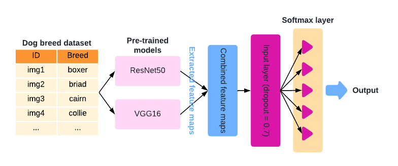
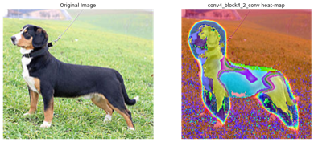
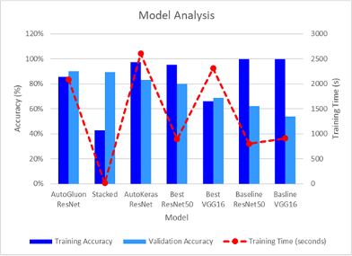

# dog-breed-image-classifier
Project to compare the performance of Transfer Learning and AutoML for dog breed image classificaiton.

# About

This project involves develop a multiclass image classifier for a set of dog breed images. While applying the following techniques: 

1. Convolution neural networks (CNNs) using transfer learning
2. Ensemble methods
3. Automated machine learning (AutoML)
4. Gradient-weight class activation mapping (Grad-CAM)

## Transfer Learning
Two CNN models were used as the primary architectures for this dataset:
- ResNet50
- VGG16

## Ensemble Model
Ensemble learning methods were employed to further improve the validation accuracy. Adapted a method to extract and combine features from each optimized ResNet50 and VGG16 model. 

## AutoML
Two different AutoML options were explored to compare, fit time and validation accuracy:

- AutoKeras (Keras) – All model architectures
- AutoGluon (Amazon) – All model architectures

## GradCam Analysis
Grad-CAM analysis was used to make the models more interpretable, by highlighting the regions of an image that was deemed important by the model

# Results
Overall AutoGluon had a validation accuract of 89.9% with a test accuracy of 91% on the test set.

# Contributors
- Brandon Attai
- Tahsin Chowdhury
- Kelten Falez
- Timothy Mok
- Aron Saengchan 
- Yong Jun Zhu 